# RuleFlow Demo 🚀

A production-quality demonstration of a **Drools-style rule engine** built with Node.js + React. Shows how business logic can evolve without code changes or redeployment.

## 🎯 Project Overview

RuleFlow Demo illustrates how to implement dynamic business rules using JSON-based configuration, similar to Drools rule engine patterns. Perfect for:

- **E-commerce platforms** with dynamic pricing rules
- **Loyalty programs** with tiered benefits
- **Banking systems** with eligibility rules
- **Insurance platforms** with underwriting rules
- **Any system** where business logic changes frequently

### Domain: Airline Loyalty Program

The demo features an **Airline Loyalty Program** with membership tiers (Silver/Gold/Platinum) and discount rules that respond to:

- Membership tier
- Total spending amount
- Booking date (weekends get bonuses!)
- Combination rules (tier + spend thresholds)

## ⚙️ Architecture

```mermaid
flowchart TD
    Frontend["🎨 React + Vite<br/><b>Frontend Layer</b><br/>━━━━━━━━━━━━━━━━<br/>• Rule Calculator<br/>• Rule Editor<br/>• Input Validation"]
    
    API["🔌 HTTP/REST API<br/><b>Communication Layer</b>"]
    
    Backend["⚙️ Node.js + Express<br/><b>Backend Layer</b><br/>━━━━━━━━━━━━━━━━<br/>• Rule Engine<br/>• Condition Evaluator<br/>• Rule Validator<br/>• API Endpoints"]
    
    FileIO["📂 File I/O<br/><b>Data Access</b>"]
    
    Rules["📋 JSON Rules File<br/><b>Rules Repository</b><br/>━━━━━━━━━━━━━━━━<br/>loyalty-rules.json<br/>Can be edited<br/>without restarts"]
    
    Frontend -->|POST /api/calculate| API
    API -->|Forward Request| Backend
    Backend -->|Load & Evaluate| FileIO
    FileIO -->|Read/Write| Rules
    Rules -->|Return Rules| FileIO
    FileIO -->|Evaluation Result| Backend
    Backend -->|JSON Response| API
    API -->|Discount & Price| Frontend
    
    classDef frontend fill:#DBEAFE,stroke:#3B82F6,stroke-width:2px,color:#1E40AF,rounded:true
    classDef api fill:#F3E8FF,stroke:#A855F7,stroke-width:2px,color:#581C87,rounded:true
    classDef backend fill:#DCFCE7,stroke:#22C55E,stroke-width:2px,color:#166534,rounded:true
    classDef io fill:#FEFCE8,stroke:#EAB308,stroke-width:2px,color:#78350F,rounded:true
    classDef rules fill:#FFEDD5,stroke:#F97316,stroke-width:2px,color:#92400E,rounded:true
    
    class Frontend frontend
    class API api
    class Backend backend
    class FileIO io
    class Rules rules
```



---

## 📊 Architecture Diagrams

### 1️⃣ High-Level Ruleflow Overview

Complete flow from user input through the rule engine to final decision output.

```mermaid
flowchart TD
    Start([👤 User Input])
    Start --> Frontend["🎨 React Frontend<br/>Rule Calculator"]
    Frontend --> API["🔌 REST API<br/>Express Server"]
    API --> Engine["⚙️ Rule Engine<br/>Priority Sorting"]
    Engine --> Repo["📋 Rules Repository<br/>loyalty-rules.json"]
    Repo --> Evaluate["🔍 Condition<br/>Evaluation"]
    Evaluate --> Match{Rules<br/>Match?}
    Match -->|Yes| Stack["🔄 Stackable<br/>Check"]
    Stack --> Action["✅ Execute<br/>Action"]
    Match -->|No| Output["📊 Final<br/>Output"]
    Action --> Output
    Output --> Result(["💰 Discount &<br/>Final Price"])
    
    classDef frontend fill:#DBEAFE,stroke:#3B82F6,stroke-width:2px,color:#1E40AF,rounded:true
    classDef backend fill:#DCFCE7,stroke:#22C55E,stroke-width:2px,color:#166534,rounded:true
    classDef rules fill:#FFEDD5,stroke:#F97316,stroke-width:2px,color:#92400E,rounded:true
    classDef process fill:#F3E8FF,stroke:#A855F7,stroke-width:2px,color:#581C87,rounded:true
    classDef decision fill:#FEFCE8,stroke:#EAB308,stroke-width:2px,color:#78350F,rounded:true
    classDef output fill:#CCFBF1,stroke:#10B981,stroke-width:2px,color:#065F46,rounded:true
    
    class Start frontend
    class Frontend frontend
    class API backend
    class Engine backend
    class Repo rules
    class Evaluate process
    class Match decision
    class Stack process
    class Action process
    class Output output
    class Result output
```



---

### 2️⃣ Rule Fetching and Execution (Sequence Diagram)

Interaction between frontend, backend, rules repository, and rule engine during a discount calculation.

```mermaid
sequenceDiagram
    participant User as 👤 User
    participant Frontend as 🎨 React Frontend
    participant API as 🔌 API Layer<br/>Express
    participant Service as ⚙️ Backend Service<br/>Rule Handler
    participant Repo as 📋 Rules Repo<br/>JSON File
    participant Engine as 🔧 Rule Engine<br/>Evaluator
    
    User->>Frontend: Enter tier, spend, date
    activate Frontend
    Frontend->>API: POST /api/calculate<br/>(tier, spend, date)
    deactivate Frontend
    
    activate API
    API->>Service: Forward evaluation request
    deactivate API
    
    activate Service
    Service->>Repo: Load all rules
    deactivate Service
    
    activate Repo
    Repo-->>Engine: Return rules array
    deactivate Repo
    
    activate Engine
    Engine->>Engine: Sort by priority
    Engine->>Engine: Evaluate conditions
    Engine->>Engine: Check stackable
    Engine->>Engine: Calculate discounts
    Engine-->>Service: Return results
    deactivate Engine
    
    activate Service
    Service->>API: Return calculated result
    deactivate Service
    
    activate API
    API-->>Frontend: JSON response<br/>(discount %, final price)
    deactivate API
    
    activate Frontend
    Frontend->>Frontend: Render results
    Frontend-->>User: Display discount breakdown
    deactivate Frontend
```



---

### 3️⃣ Business Rule Management Flow

How business users manage, test, and deploy rule changes without code.

```mermaid
flowchart LR
    Start([👨‍💼 Business User])
    
    Start --> Edit["✏️ Edit Rule File<br/>YAML/JSON"]
    Edit --> Validate{Validate<br/>Schema?}
    
    Validate -->|Invalid| Error["❌ Show Error<br/>Message"]
    Error --> Edit
    
    Validate -->|Valid| VC["📦 Version Control<br/>Git Commit"]
    VC --> Push["🚀 Push to<br/>Repository"]
    
    Push --> AutoLoad["🔄 Auto-Load<br/>in Engine"]
    AutoLoad --> Reload["♻️ Engine Reloads<br/>Rules in Memory"]
    
    Reload --> Test["🧪 Test New<br/>Rules"]
    Test --> Dashboard["📊 Dashboard<br/>View Results"]
    
    Dashboard --> Monitor["👁️ Monitor<br/>Outcomes"]
    Monitor --> Success{Rules<br/>Working?}
    
    Success -->|No| Edit
    Success -->|Yes| Done(["✅ Live in<br/>Production"])
    
    classDef user fill:#DBEAFE,stroke:#3B82F6,stroke-width:2px,color:#1E40AF,rounded:true
    classDef edit fill:#FFEDD5,stroke:#F97316,stroke-width:2px,color:#92400E,rounded:true
    classDef validate fill:#FEFCE8,stroke:#EAB308,stroke-width:2px,color:#78350F,rounded:true
    classDef system fill:#DCFCE7,stroke:#22C55E,stroke-width:2px,color:#166534,rounded:true
    classDef monitor fill:#F3E8FF,stroke:#A855F7,stroke-width:2px,color:#581C87,rounded:true
    classDef decision fill:#FCE7F3,stroke:#EC4899,stroke-width:2px,color:#831843,rounded:true
    classDef success fill:#CCFBF1,stroke:#10B981,stroke-width:2px,color:#065F46,rounded:true
    
    class Start user
    class Edit edit
    class Validate validate
    class Error validate
    class VC system
    class Push system
    class AutoLoad system
    class Reload system
    class Test monitor
    class Dashboard monitor
    class Monitor monitor
    class Success decision
    class Done success
```



---

### 4️⃣ Internal Rule Evaluation Flow

Step-by-step logic inside the rule engine when evaluating rules against input data.

```mermaid
flowchart TD
    Start(["📥 Input Data<br/>(tier, spend, date)"])
    
    Start --> Load["📂 Load All Rules<br/>from Repository"]
    Load --> Sort["🔢 Sort Rules<br/>by Priority"]
    Sort --> Loop["🔄 For Each Rule<br/>in Order"]
    
    Loop --> CheckCond{Condition<br/>Matches?}
    CheckCond -->|No| NextRule["⏭️ Move to<br/>Next Rule"]
    NextRule --> EndLoop{More<br/>Rules?}
    
    CheckCond -->|Yes| CheckStack{Rule<br/>Stackable?}
    
    CheckStack -->|No| CheckApplied{Already<br/>Applied?}
    CheckApplied -->|Yes| NextRule
    CheckApplied -->|No| Execute["✅ Execute<br/>Action"]
    
    CheckStack -->|Yes| Execute
    
    Execute --> AddDiscount["💰 Add Discount<br/>to Total"]
    AddDiscount --> AddRecord["📝 Record Applied<br/>Rule"]
    AddRecord --> NextRule
    
    EndLoop -->|Yes| Loop
    EndLoop -->|No| Calculate["🧮 Calculate<br/>Final Amount"]
    
    Calculate --> BuildResult["🏗️ Build Result<br/>Object"]
    BuildResult --> Output(["📊 Output Result<br/>Applied Rules +<br/>Final Price"])
    
    classDef input fill:#DBEAFE,stroke:#3B82F6,stroke-width:2px,color:#1E40AF,rounded:true
    classDef process fill:#DCFCE7,stroke:#22C55E,stroke-width:2px,color:#166534,rounded:true
    classDef decision fill:#FEFCE8,stroke:#EAB308,stroke-width:2px,color:#78350F,rounded:true
    classDef action fill:#F3E8FF,stroke:#A855F7,stroke-width:2px,color:#581C87,rounded:true
    classDef calculate fill:#FFEDD5,stroke:#F97316,stroke-width:2px,color:#92400E,rounded:true
    classDef output fill:#CCFBF1,stroke:#10B981,stroke-width:2px,color:#065F46,rounded:true
    
    class Start input
    class Load process
    class Sort process
    class Loop process
    class NextRule process
    class CheckCond decision
    class CheckStack decision
    class CheckApplied decision
    class EndLoop decision
    class Execute action
    class AddDiscount action
    class AddRecord action
    class Calculate calculate
    class BuildResult calculate
    class Output output
```



---

## 🏗️ Project Structure

```
ruleflow-demo/
├── backend/                          # Node.js + Express server
│   ├── src/
│   │   ├── server.js                # Express app setup
│   │   ├── engine/
│   │   │   ├── ruleEngine.js        # Core rule evaluation
│   │   │   ├── conditionEvaluator.js # AND/OR/comparison logic
│   │   │   └── ruleValidator.js     # Rule schema validation
│   │   ├── routes/
│   │   │   ├── calculate.js         # POST /api/calculate
│   │   │   └── rules.js             # GET/POST /api/rules
│   │   └── utils/
│   │       └── dateUtils.js         # Date-based conditions
│   ├── rules/
│   │   └── loyalty-rules.json       # Dynamic rules configuration
│   └── package.json
│
├── frontend/                         # React + Vite app
│   ├── src/
│   │   ├── App.jsx                  # Main app component
│   │   ├── main.jsx                 # React entry point
│   │   ├── components/
│   │   │   ├── Calculator/
│   │   │   │   ├── RuleCalculator.jsx
│   │   │   │   └── ResultDisplay.jsx
│   │   │   └── RuleEditor/
│   │   │       └── RuleEditor.jsx
│   │   ├── utils/
│   │   │   └── api.js               # API client
│   │   └── styles/
│   │       └── app.css              # Styling
│   ├── index.html
│   ├── vite.config.js
│   └── package.json
│
├── README.md                         # This file
└── .gitignore
```

## 🚀 Quick Start

### Prerequisites

- Node.js 18+
- npm or yarn

### Installation & Running

**1. Clone the repository:**
```bash
git clone https://github.com/sivabalanb/ruleflow-demo.git
cd ruleflow-demo
```

**2. Start the backend (Terminal 1):**
```bash
cd backend
npm install
npm run dev
```

You should see:
```
╔══════════════════════════════════════════╗
║  🚀 RuleFlow Demo Server Started         ║
╚══════════════════════════════════════════╝

📡 Server: http://localhost:3001
📊 Health: http://localhost:3001/api/health
📋 Rules: http://localhost:3001/api/rules
```

**3. Start the frontend (Terminal 2):**
```bash
cd frontend
npm install
npm run dev
```

Open http://localhost:3000 in your browser.

## 📊 How It Works

### The Rule Engine

The rule engine evaluates complex business rules with:

1. **Priority-based execution** - Rules with lower priority numbers execute first
2. **AND/OR logic** - Support for complex nested conditions
3. **Stackable discounts** - Multiple rules can combine their effects
4. **Condition operators** - ==, !=, >, <, >=, <=, IN, NOT_IN, CONTAINS, etc.

### Example Rule

```json
{
  "id": "platinum-vip-high-spender",
  "priority": 1,
  "description": "Platinum members spending over $5000",
  "condition": {
    "operator": "AND",
    "conditions": [
      { "field": "tier", "operator": "==", "value": "platinum" },
      { "field": "total_spend", "operator": ">", "value": 5000 }
    ]
  },
  "action": {
    "discountPercent": 20,
    "message": "🏆 Platinum VIP discount (20%) applied!",
    "stackable": false
  }
}
```

### Demo Rules Included

| Rule | Tier | Condition | Discount |
|------|------|-----------|----------|
| Platinum VIP | Platinum | spend > $5,000 | 20% |
| Platinum | Platinum | any | 15% |
| Gold High-Spender | Gold | spend > $5,000 | 12% |
| Gold | Gold | any | 10% |
| Silver | Silver | any | 5% |
| Weekend Bonus | Gold/Platinum | weekend | +5% |
| High Spend Bonus | Any | spend > $5,000 | +2% |
| Bulk Purchase | Any | spend >= $10,000 | +3% |
| Holiday Bonus | Any | Dec 15 - Jan 15 | +3% |

## 🧮 Using the Calculator

1. **Select a membership tier** (Silver, Gold, or Platinum)
2. **Enter total spending** (try $6,000 to unlock bonuses!)
3. **Choose a booking date** (weekends get bonuses)
4. **Click "Calculate Discount"**
5. **See applied rules** and final price breakdown

**Quick test buttons** let you instantly try common scenarios.

## ✏️ Editing Rules

The **Rule Editor** tab lets you:

1. **View current rules** as formatted JSON
2. **Edit rules** directly in the editor
3. **Validate** before saving
4. **Format JSON** automatically
5. **Save changes** - immediately takes effect on the backend!

### Key Editing Tips

- Rules execute in **priority order** (lower number = higher priority)
- **Non-stackable rules** exclude lower-priority matches
- **Stackable rules** can combine with others
- Use **Validate** before saving to catch errors
- Changes **take effect immediately** - no server restart needed!

## 🔌 API Endpoints

### Health Check
```bash
GET /api/health
```

Response:
```json
{
  "status": "ok",
  "timestamp": "2025-10-31T10:20:00Z",
  "rulesLoaded": 9
}
```

### Calculate Discount
```bash
POST /api/calculate
Content-Type: application/json

{
  "tier": "gold",
  "total_spend": 6000,
  "booking_date": "2025-11-01"
}
```

Response:
```json
{
  "success": true,
  "input": {
    "tier": "gold",
    "total_spend": 6000,
    "booking_date": "2025-11-01",
    "day_of_week": "Saturday"
  },
  "result": {
    "original_amount": 6000,
    "discount_percent": 17,
    "discount_amount": 1020,
    "final_amount": 4980,
    "applied_rules": [
      {
        "rule_id": "gold-high-spender",
        "description": "Gold members spending over $5000",
        "discount_percent": 12,
        "message": "✨ Gold member high-spender bonus (12%) applied!"
      },
      {
        "rule_id": "weekend-bonus",
        "description": "Weekend shoppers get extra 5% bonus",
        "discount_percent": 5,
        "message": "🎉 Weekend bonus (5%) stacked!"
      }
    ],
    "message": "2 rules applied for 17% total discount"
  }
}
```

### Get Rules
```bash
GET /api/rules
```

### Update Rules
```bash
POST /api/rules
Content-Type: application/json

{ "rules": [...] }
```

### Validate Rules
```bash
POST /api/rules/validate
Content-Type: application/json

{ "rules": [...] }
```

### Rule Schema Documentation
```bash
GET /api/rules/schema
```

## 📋 Condition Syntax

### Simple Conditions

```json
{ "field": "tier", "operator": "==", "value": "gold" }
{ "field": "total_spend", "operator": ">", "value": 5000 }
{ "field": "day_of_week", "operator": "IN", "value": ["Saturday", "Sunday"] }
```

### Compound Conditions (AND/OR)

```json
{
  "operator": "AND",
  "conditions": [
    { "field": "tier", "operator": "==", "value": "gold" },
    { "field": "total_spend", "operator": ">", "value": 5000 }
  ]
}
```

### Supported Operators

| Operator | Description | Example |
|----------|-------------|---------|
| `==` | Equals | `tier == "gold"` |
| `!=` | Not equals | `tier != "silver"` |
| `>` | Greater than | `total_spend > 5000` |
| `<` | Less than | `total_spend < 1000` |
| `>=` | Greater or equal | `total_spend >= 5000` |
| `<=` | Less or equal | `total_spend <= 10000` |
| `IN` | In array | `tier IN ["gold", "platinum"]` |
| `NOT_IN` | Not in array | `tier NOT_IN ["bronze"]` |
| `CONTAINS` | String contains | `message CONTAINS "bonus"` |
| `STARTS_WITH` | Starts with | `email STARTS_WITH "admin"` |
| `ENDS_WITH` | Ends with | `email ENDS_WITH "@company.com"` |
| `IS_WEEKEND` | Weekend check | `booking_date IS_WEEKEND` |
| `DATE_RANGE` | Date range | `booking_date DATE_RANGE {"start": "2025-12-15", "end": "2026-01-15"}` |

## 🌐 Deployment

**Complete deployment guide with step-by-step instructions:** 📚 [**See DEPLOYMENT.md**](./DEPLOYMENT.md)

### Quick Summary

**Frontend & Backend on Render (Recommended):**
- Both services deploy independently
- Frontend as Static Site, Backend as Web Service
- Automatic redeployment on git push
- Free tier available
- **Full Guide:** [DEPLOYMENT.md](./DEPLOYMENT.md)

**Architecture:**
```
GitHub Repository
    ├─→ Render Frontend (Static Site)
    │   └─→ https://your-frontend.onrender.com
    └─→ Render Backend (Web Service)
        └─→ https://your-backend.onrender.com
```

**Key Files for Deployment:**
- [`render.yaml`](./render.yaml) - Render deployment configuration
- [`DEPLOYMENT.md`](./DEPLOYMENT.md) - Complete deployment guide
- [`backend/.env.example`](./backend/.env.example) - Backend environment variables
- [`frontend/.env.example`](./frontend/.env.example) - Frontend environment variables

## 📚 Extending the Demo

### Adding New Rules

Edit `backend/rules/loyalty-rules.json`:

```json
{
  "id": "my-new-rule",
  "priority": 10,
  "description": "My custom rule",
  "condition": { "field": "tier", "operator": "==", "value": "gold" },
  "action": { "discountPercent": 5, "message": "Custom rule applied" }
}
```

Click **Validate** → **Save** in the Rule Editor UI.

### Adding New Condition Fields

1. Modify `RuleCalculator.jsx` to accept new input
2. Pass additional fields to `/api/calculate`
3. Backend automatically evaluates them

Example: Adding `customer_age`:
```javascript
const evaluationData = {
  tier: formData.tier,
  total_spend: formData.total_spend,
  booking_date: formData.booking_date,
  customer_age: formData.customerAge  // New field
};
```

## 🔍 Understanding Rule Priority

Rules execute in priority order. Lower numbers = higher priority:

```
Priority 1: platinum-vip-high-spender (20%) - MATCHES
Priority 2: platinum-discount (15%) - SKIPPED (non-stackable)
Priority 3: gold-high-spender (12%) - DOESN'T MATCH
Priority 4: gold-discount (10%) - DOESN'T MATCH
Priority 5: silver-discount (5%) - DOESN'T MATCH
Priority 6: weekend-bonus (5%, stackable) - MATCHES
Priority 7: high-spend-bonus (2%, stackable) - MATCHES
Priority 8: bulk-purchase-bonus (3%, stackable) - DOESN'T MATCH
Priority 9: holiday-season-bonus (3%, stackable) - DOESN'T MATCH
```

**Result**: 20% + 5% + 2% = 27% total (if all conditions match)

## 🎓 Key Concepts Demonstrated

1. **Rule Engines** - Externalize business logic from code
2. **Priority-based Evaluation** - Control rule precedence
3. **Stackable Rules** - Combine multiple matching rules
4. **Complex Conditions** - AND/OR logic and nested conditions
5. **Dynamic Configuration** - Change rules without redeployment
6. **API-driven Architecture** - Clean separation of concerns
7. **Real-time Validation** - Catch errors before saving
8. **Type Safety** - JSON schema validation

## 🧪 Testing the Rule Engine

### Test Case 1: Platinum High Spender
- Tier: Platinum
- Spend: $8,000
- Expected: 20% + 2% (high spend) = 22% total

### Test Case 2: Gold Weekend Shopper
- Tier: Gold
- Spend: $3,000
- Booking Date: Any Saturday
- Expected: 10% + 5% (weekend) = 15% total

### Test Case 3: Platinum Bulk Purchase
- Tier: Platinum
- Spend: $12,000
- Expected: 15% + 2% + 3% = 20% total

## 📖 Further Reading

- [Drools Documentation](https://www.drools.org/)
- [Rule Engine Pattern](https://en.wikipedia.org/wiki/Business_rules_engine)
- [React Documentation](https://react.dev/)
- [Express.js Documentation](https://expressjs.com/)

## 🤝 Contributing

This is an open-source demo project! Feel free to:

- Fork the repository
- Add new rule types
- Improve the UI
- Add persistence (database)
- Create admin dashboard
- Add rule versioning
- Implement audit logging

## 📝 License

MIT License - feel free to use for learning and projects!

## 🙋 FAQ

**Q: Can I use this in production?**
A: This is a demo for educational purposes. For production, consider: database persistence, audit logging, rule versioning, performance optimization, and comprehensive testing.

**Q: How do I add new condition types?**
A: Add new operators in `conditionEvaluator.js` and update validation in `ruleValidator.js`.

**Q: What if rules become very large?**
A: Consider splitting into multiple rule files or using a database for rule storage.

**Q: Can I integrate with existing systems?**
A: Yes! The backend is a standard REST API. Create a client in any language to call `/api/calculate`.

---

**Happy rule-making! 🎉** For issues and questions, please open an issue on GitHub.
